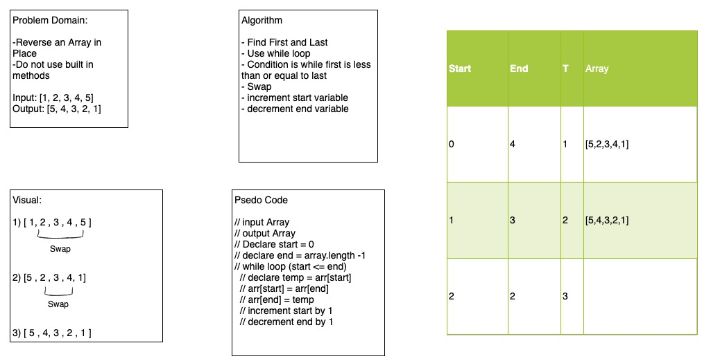

# Reverse an Array

<!-- Short summary or background information -->

Code Challenge 01- Reverse an Array

## Challenge

<!-- Description of the challenge -->

Take an array and reverse it in place. Do not use built in methods

## Approach & Efficiency

<!-- What approach did you take? Why? What is the Big O space/time for this approach? -->

- Iterate the array
- Declare the start
- Declare the end
- Swap the start and end index
- Increment start variable
- Decrement end variable
- When at the middle, stop

## Solution

<!-- Embedded whiteboard image -->

