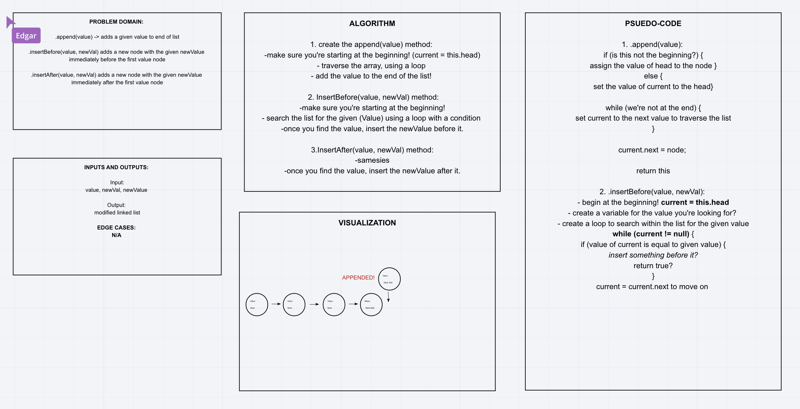
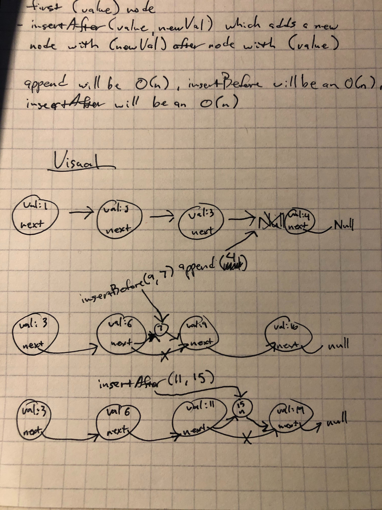
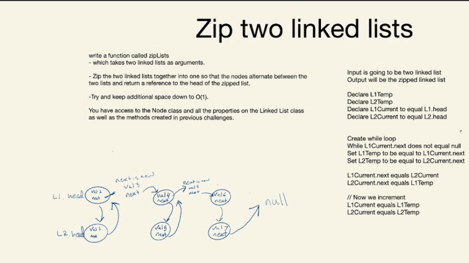

# Code Challenge 5: Singly Linked List

<!-- Short summary or background information -->

## Challenge Description

<!-- Description of the challenge -->

Create 3 methods that can be used on singly linked list.

- insert: adds node to beggining of list
- includes: returns a boolean value if node exist in list
- toString: returns string representing all values in linked list

## Approach & Efficiency

<!-- What approach did you take? Why? What is the Big O space/time for this approach? -->

Insert:

- declare current variable to hold reference to head.
- create new node Instance
- assign node.next to equal current
- reassign head to what node is now
- Big O is: Time - O(n) / Space - O(n)

Includes:

- declare current variable to equal head
- iterate through list
- if current value equals search value
- return true
- otherwise return false
- Big O is: Time - O(n) / Space - O(n)

toString:

- itereate over the node while current.next exist
- add current value into a string variable
- once current.next doesnt exist
- add null to the end
- Big O is: Time - O(n) / Space - O(n)

<!-- ## Solution(Whiteboard) -->

<!-- Description of each method publicly available to your Linked List -->

 
 

# Code Challenge 6: Linked List Insertions

<!-- Short summary or background information -->

Create methods to insert nodes into linked list.

## Challenge Description

<!-- Description of the challenge -->

- insertBefore: function will take two parameters. A value to search for and a newVal to add. Insert new node BEFORE target value.

- insertAfter: function will take two parameters. A value to search for and a newVal to add. Insert new node AFTER target value.

- append: add node to end of list

## Approach & Efficiency

<!-- What approach did you take? Why? What is the Big O space/time for this approach? -->

insertBefore(value, newVal) :

- declare a previous and current variable
- iterate over linked list
  - if value is found
    - insert before node

insertAfter(value, newVal) :

- declare a previous and current variable
- iterate over linked list
  - if value is found
    - insert after node

append(value):

- iterate over the linked list till the end
- reassign current.next to equal the inserted node

## Solution(Whiteboard)

<!-- Embedded whiteboard image -->

 
 

# Code Challenge 7

<!-- Short summary or background information -->

## Challenge Description

<!-- Description of the challenge -->

Given a number "k", find the value of a node "k" distance from the end of the linked list.

## Approach & Efficiency

<!-- What approach did you take? Why? What is the Big O space/time for this approach? -->

- Iterate over linked list to find length
- Iterate a second time the distance of length-k
- return value at node
- Time is O(n), Space is 0(1)

## Solution

<!-- Embedded whiteboard image -->

 
 

# Code Challenge 8

<!-- Short summary or background information -->

## Challenge Description

<!-- Description of the challenge -->

Given two linked list, zip both of them together.

## Approach & Efficiency

<!-- What approach did you take? Why? What is the Big O space/time for this approach? -->

- declare two temporary variables for storing the next node in each list
- declare two current variables to start at the head of each list
- Create while loop to iterate over first list
- Connect the current node of list2 to current node of list 1
- The current node of list 2 will connect to the original next node of list 1
- Increment each current node to the next node in the list
- Time is O(n) Space is O(n);

## Solution

<!-- Embedded whiteboard image -->

