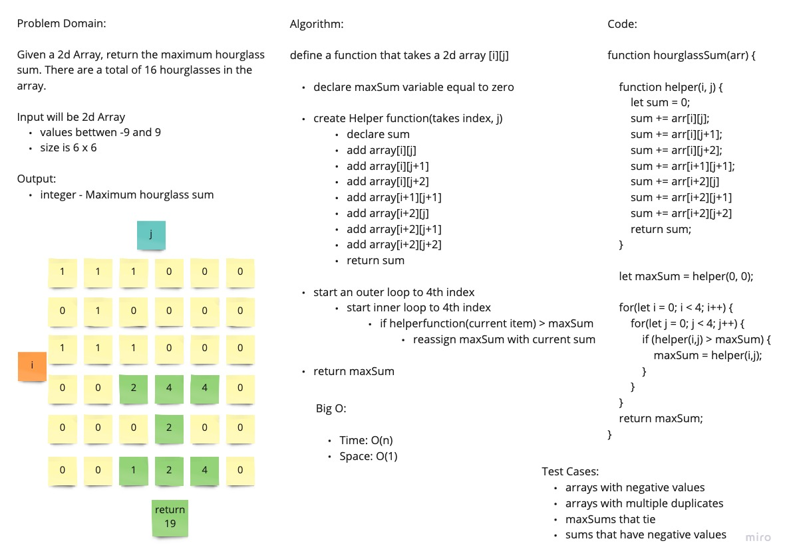

# 2d Array

Given a 6x6 Array, return the maximum hourglass sum. There are 16 hourglasses in the nested array.

## Whiteboard Process

## Approach and Efficiency

I utilized a helper function to get the sum of each hourglass group. I declared a maxSum variable to keep track of the current maxSum. I looped through the first 4 indexes of the outer arrays and inner arrays.

Big O:

- Space: O(n)
- Time: O(n)
