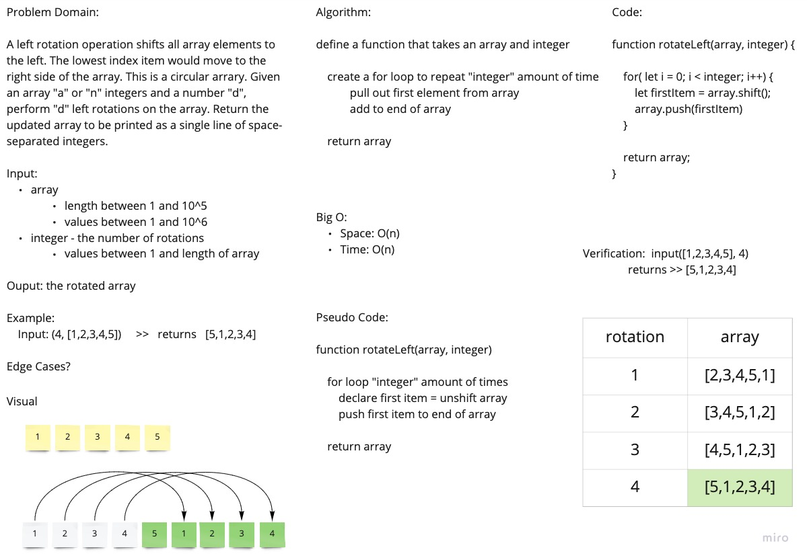

# Array Left Rotation

Given an array "a" and a number "d", perform "d" left rotations on the array.

## White Board Process

## Approach and Efficiency

I created a loop performed "d" number of times. On each iteration I took the first value and added to the end of the array.

Big O:

- Space: O(n)
- Time: O(n)
