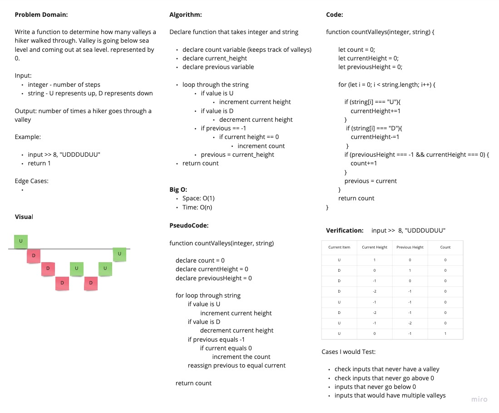

# Count the Valleys

Given a string and an integer representing the amount of steps, return how many times the hiker went through a valley. A "D" means stepping down, and "U" means stepping up. Hikers will start at sea level and end at sea level. A valley is considered in a valley when he is below sea level.

## Whiteboard Process

## Approach and Efficiency

Loop through the string. Increment currrent height variable based on if its going up or down. Keep track of the current height and previous height. Whenever the height went from -1 to 0, I incremented the count.

Big O:

- Space : O(n)
- Time : O(n)
