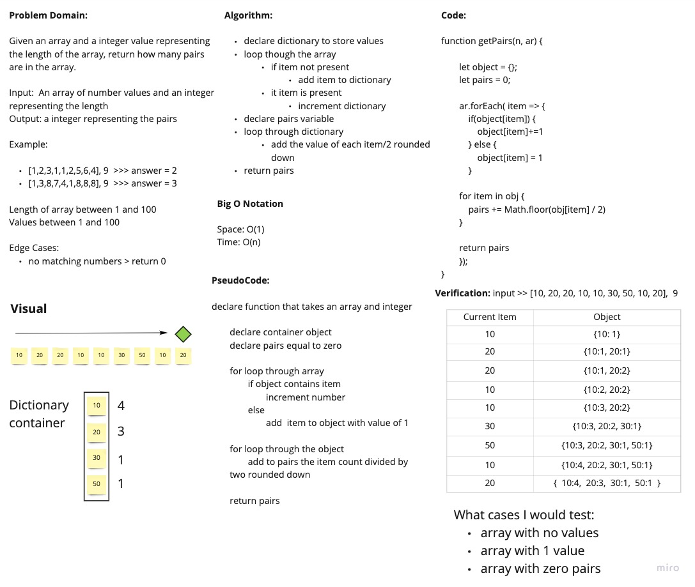

# Find the Pairs

Given an array of numbers and an integer that represents the length of the array, return the amount of matching pairs in the array.

## Whiteboard Process

## Approach & Efficiency

The approach I took was to use an object as a container to keep count of the items in the array. On each iteration, if the item is in the array, I'll incrment the count, otherwise Ill add the current item with a value of 1. At the end, I'll loop through the object and find how many pairs there are and return that.

Big O:

- Time: O(n)
- Space: O(n)
