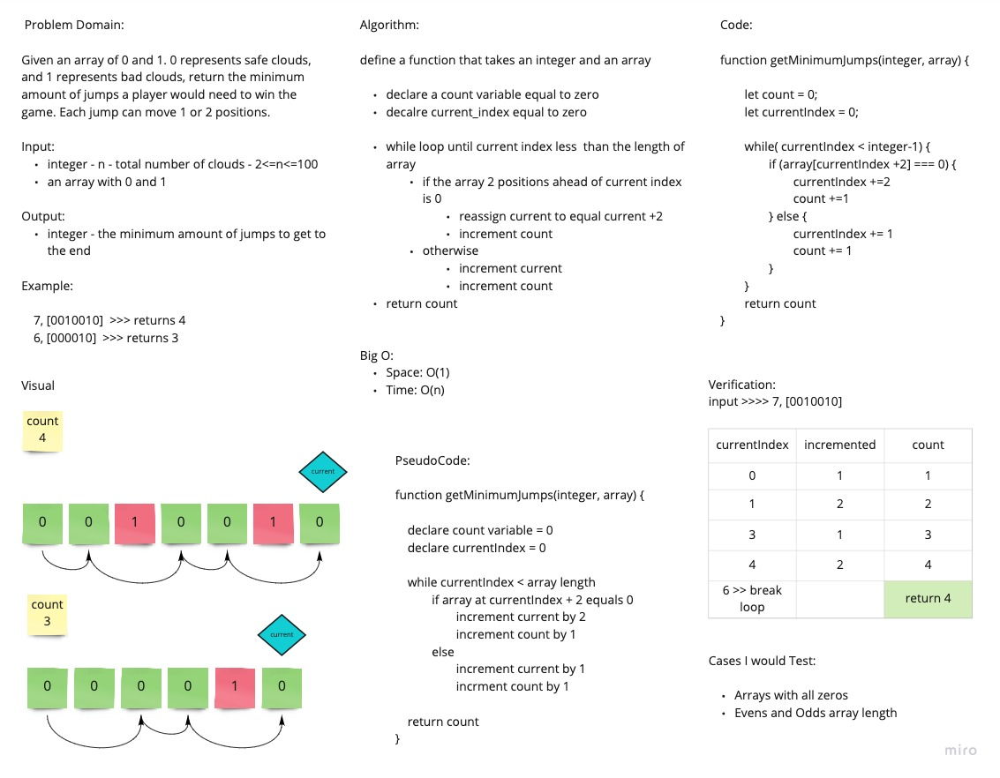

# Jumping on the Clouds

Given an array of 0 and 1, return the minimum amount of jumps a player would need to get to the end. O represents a safe cloud and 1 represents clouds to avoid. A player can only move 1 or 2 positions forward. There is always a path to the end.

## Whiteboard Process

## Approach and Efficiency

I utilized two variables and a loop. A count variable incremented when the player moves, and a current index variable to keep track of position. If the position 2 slots ahead is safe, then reassign current to that position and increment count. Otherwise, increment both current position and count by 1. Return the count at the end

Big O:

- Time: O(n)
- Space: O(n)
