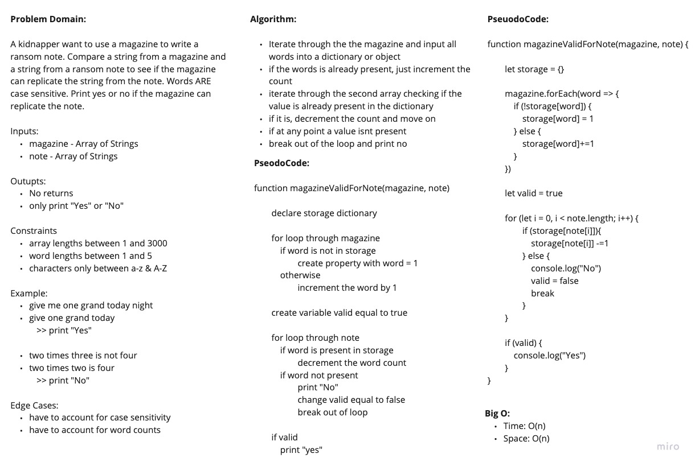

# Ransom Note

A kidnapper wants to pull words from a magazine to use in his ransom note. He needs to pull out full words and not letters. Print "Yes" or "No" whether the words from the magazine will be able to fulfill his ransom note. Case Sensitivity is important

## White Board

## Approach and Efficiency

I utilized a storage object or a dicionary for this solution. I iterated over the magazine words and if the word isn't present in storage, I would add that word to storage with a value of 1. If its already in storage, I would just increment count by 1. Once magazine gets checked, now I will check every word in the note list. If the word in the note list is present in storage, I would just decrement the count and move on. If word is not present in storage, then I know the magazine wont be able to produce the note and I print "No" and break out of the loop. Since a return is not allowed in this function, I had to make use of a variable to store a boolean whether to print "Yes" at the end.

Big O:

- Time: O(n)
- Space: O(n)
