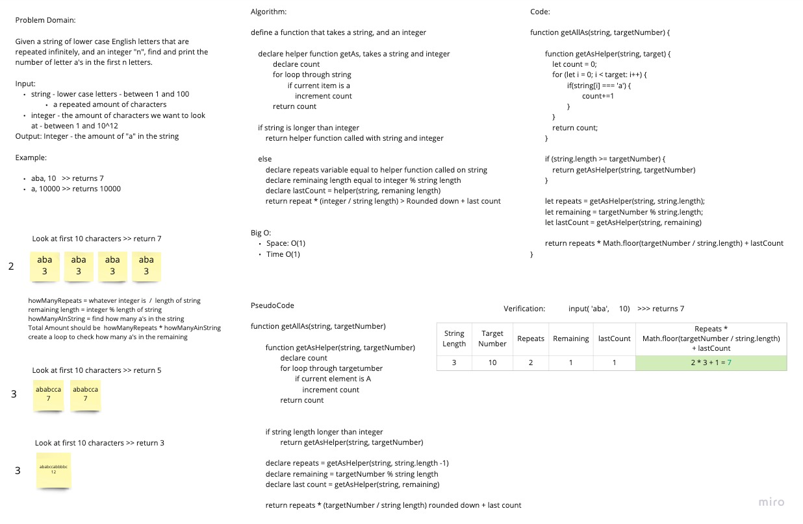

# Repeated Strings

Given a set of strings that repeat infinitely and a integer "n", find out how many "a"s are in the first "n" letters.

## Whiteboard Process

## Approach and Efficiency

Find out how many "a's are in the given string. Multiply that number by how many times the string length goes into the number. Add the remaining "a"s from the last set of integer if there is a remainder. If "n" is less than the string length, just check how many "a"s are within "n" count.

Big O:

- Space: O(1)
- Time: 0(1) I think this could be argued of having an O(1) since the algorithm is more of a formula than iterating through the entire data set.
