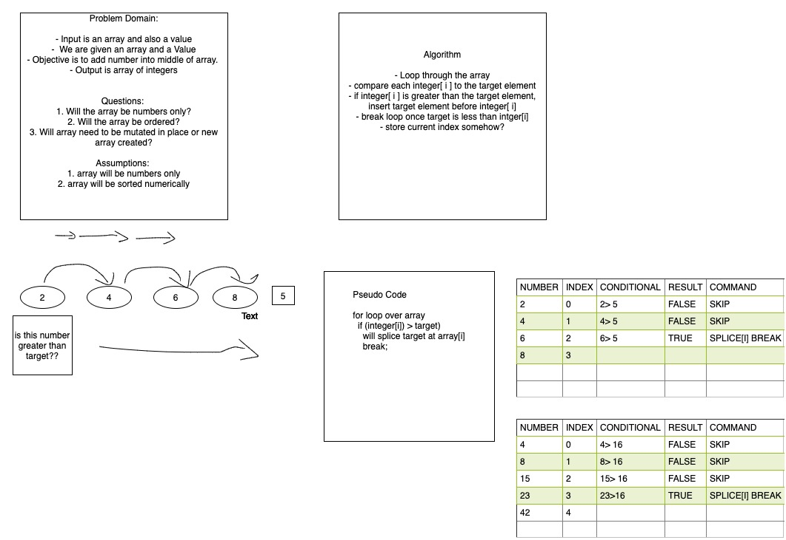

# Challenge Summary

<!-- Short summary or background information -->

Code Challenge 2: ArrayShift

## Challenge Description

<!-- Description of the challenge -->

Insert a new value into the middle of an array while keeping everything in numberical order.

## Approach & Efficiency

<!-- What approach did you take? Why? What is the Big O space/time for this approach? -->

We used a for loop with array.splice. Inside the for loop we used a conditional statement to compare each element to the target input. If the target element is more than the current element, than we splice the input directly at the current index.

## Solution

<!-- Embedded whiteboard image -->

