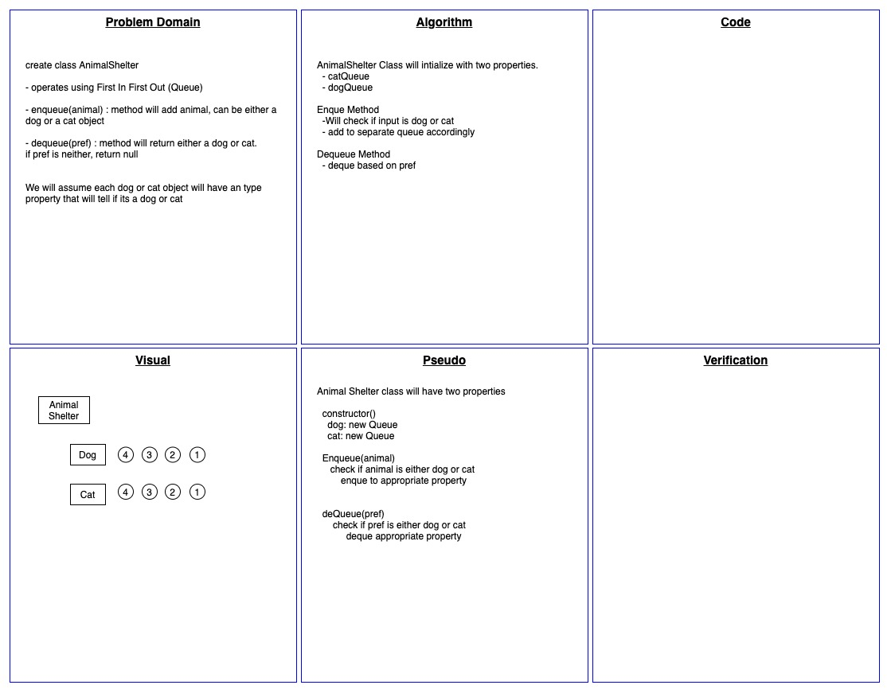

# Code Challenge 12 - Animal Shelter

<!-- Short summary or background information -->

## Challenge Description

<!-- Description of the challenge -->

Build an AnimalShelter class that enqueues and dequeues animal based on if its a dog or cat

## Approach & Efficiency

<!-- What approach did you take? Why? What is the Big O space/time for this approach? -->

Create a class with a property for dogs and cat. Both properties will be initialized with a Queue class

Big O Time O(n)
Big O Space O(n)

## Solution

<!-- Embedded whiteboard image -->

