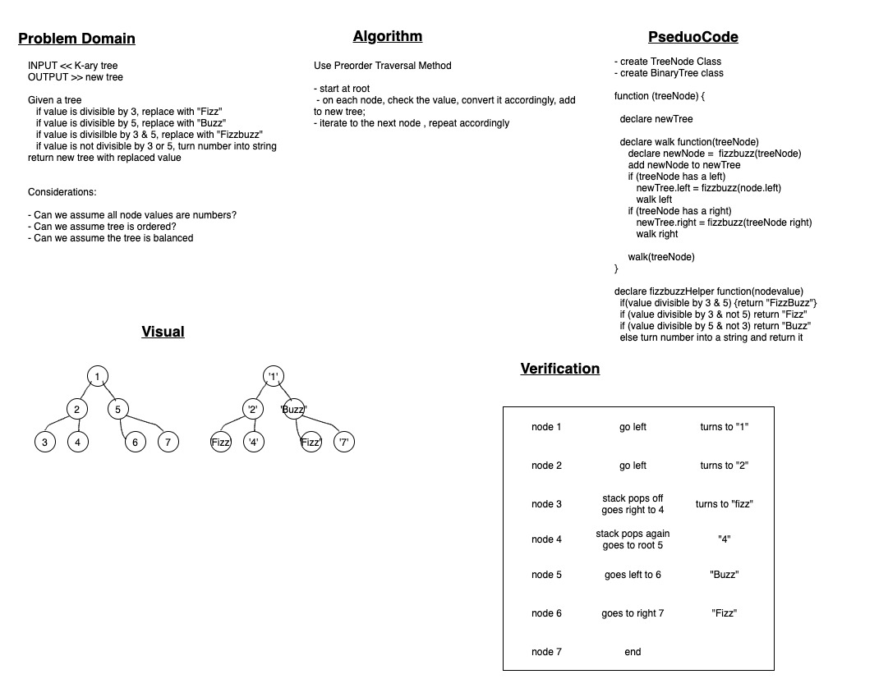

# Code Challenge 18: Fizz Buzz Tree

<!-- Short summary or background information -->

## Challenge Description

<!-- Description of the challenge -->

Given a K-ary tree, create a new tree with the same structure as the original but modify the values according to the following

value divisible by 3 >> replace with "Fizz"  
value divisible by 5 >> replace with "Buzz"  
value divisible by 3 & 5 >> replace with "FizzBuzz"  
if divisible by neither >> turn number into string

## Approach & Efficiency

<!-- What approach did you take? Why? What is the Big O space/time for this approach? -->

Do a preorder traversal, checking each node value as we traverse, and add to the new tree.

Space: O(n)  
Time: O(n)

## Solution

<!-- Embedded whiteboard image -->

