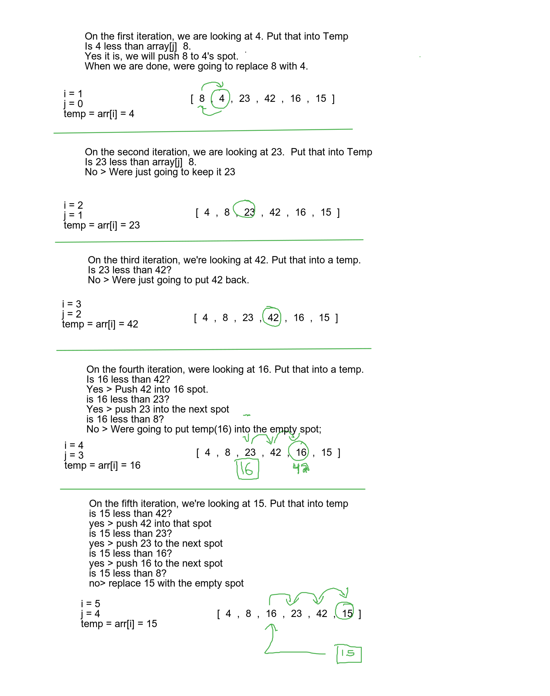

# Challenge 26 - Insertion Sort

<!-- Short summary or background information -->

## Challenge Description

<!-- Description of the challenge -->

Implement an insertion sort function that sorts a numbered array

## Approach & Efficiency

<!-- What approach did you take? Why? What is the Big O space/time for this approach? -->

Iterate the array. Using a for loop. Have a temp variable. Using a while loop, Compare that value against previous items in the array. On each compare, keep pushing the items, forward in the array until the temp variable is no longer less than the value being compared. At the end, reassign the empty spot with the temp Array

Space: O(1)
Time: 0(n^2)

## Solution

<!-- Embedded whiteboard image -->

