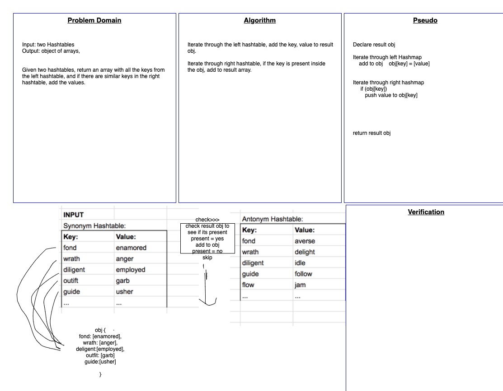

# Code Challenge 33 : Hashmap LEFT JOIN

<!-- Short summary or background information -->

## Challenge

<!-- Description of the challenge -->

Given two hashmaps, implement a simplified left join. Create a new data structure with all the values of the left hashmap and if the right hashmap also has those values, add to the new data structure.

## Approach & Efficiency

<!-- What approach did you take? Why? What is the Big O space/time for this approach? -->

Iterate over the first map and add key, value to result object. Object values will be arrays. On each iteration, also check if map2 has the same key. If it does, add it to the corresponding property. if not, add null.

Space: O(n)  
Time: O(n)

## Solution

<!-- Embedded whiteboard image -->

