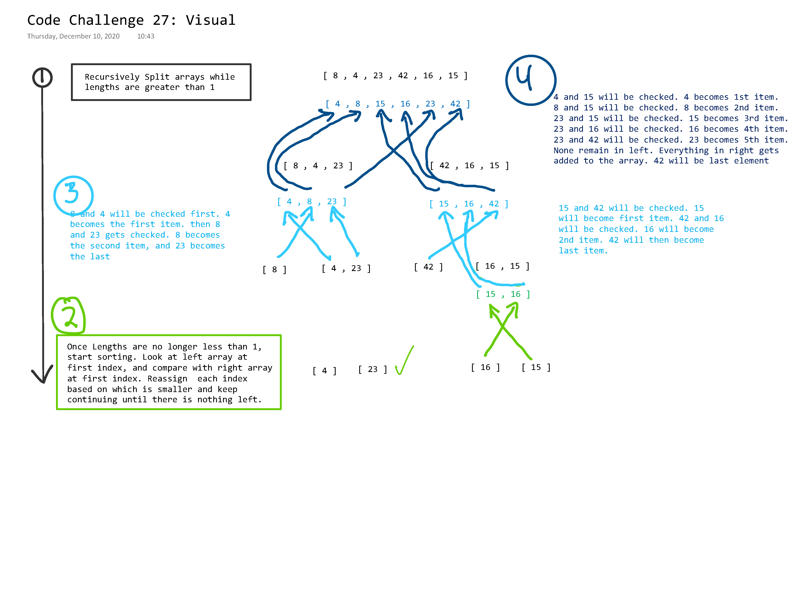

# Code Challenge 27: Merge Sort

<!-- Short summary or background information -->

## Challenge Description

<!-- Description of the challenge -->

Implement a merge sort method to sort a numbered array.

## Approach & Efficiency

<!-- What approach did you take? Why? What is the Big O space/time for this approach? -->

Divide and Conquer. Use a recursive function to split the array in half until the lengths are 1. Then start comparing the left and right array starting from the first index. Reassign the first index depending on which out of the left and right array has the lower value. Then move to the next index and check the remaining values from the left and right array.

Time: O(n \* Log n)
Space: O(n)

## Solution

<!-- Embedded whiteboard image -->

