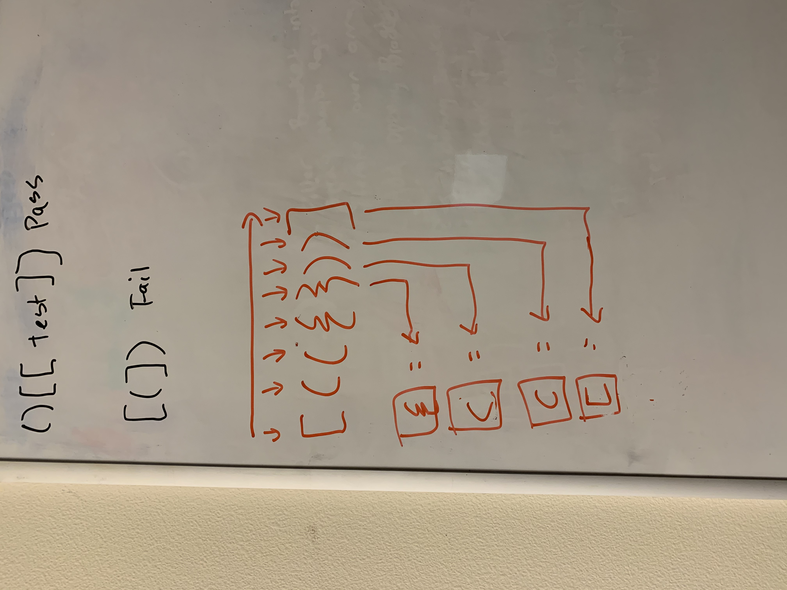

# Challenge 13: Multi-bracket Validation

<!-- Short summary or background information -->

## Challenge Description

<!-- Description of the challenge -->

Create a function that will take a string containing brackets and return boolean whether the brackets are balance. Meaning each opening bracket corresponds with closing bracket.

## Approach & Efficiency

<!-- What approach did you take? Why? What is the Big O space/time for this approach? -->

Iterate over the string.  
If the current element is an opening bracket, add it to a stack.  
If the current element is a closing bracket, pop off the stack and see if the brackets correspond to each other.  
If at any point, the brackets don't match return false.
At the end, return whether the stack is empty.

Big O for time is O(n)
Big 0 for space is O(n)

## Solution

<!-- Embedded whiteboard image -->

#### Problem Domain

```
INPUT will be a string containing letters and brackets
OUTPUT will be boolean representing whether brackets are balanced

Balanced means opening bracket has to match with corresponding closing bracket
```

#### Algorithm

```
- Take String and filter out all the brackets into its own array
- Iterate over the array and add the opening brackets into a stack
- If its a closing bracket, test to see if it matches corresponding bracket in the stack
```

#### Pseodo Code

```
Input will be a string
Output will be boolean whether the brackets are balanced

Use regex to match all brackets into its own array
Declare en empty stack to store opening brackets
Declare object with closing bracket as key and opening bracket as value pair

Iterate over the array
  if current element is an opening bracket
    add to stack
  else if its a closing bracket
    if it matches corresponding opening bracket in stack
      pop off stack
    otherwise
      return false
If stack is empty
   return true
```

#### Visual



#### Verification

```
Mismatched brackets will return false
Uneven brackets will return false
if stack is empty at the end, will return true
```
