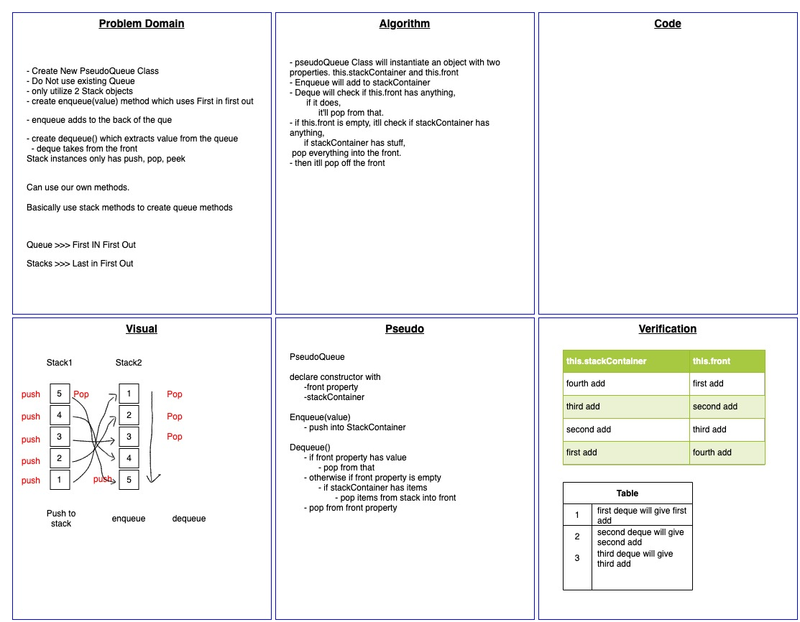

# Challenge Summary : Code Challenge 11 - Queue with stacks

<!-- Short summary or background information -->

Use Stack data structure to create Queue

## Challenge Description

<!-- Description of the challenge -->

Can use pop, push, and peek. Cant use any queue methods

## Approach & Efficiency

<!-- What approach did you take? Why? What is the Big O space/time for this approach? -->

Create PseudoQueue class with two properties.

A front which will hold linked list of whats next in queue

A stackedContainer that holds everything that has been added.

If Deque is ever called , it will check if front has anything, and it will take from there first. Otherwise, it will empty stacked container into front, and pop from front.

Big O Space O(n)
Big O Time o(n)

## Solution

<!-- Embedded whiteboard image -->

