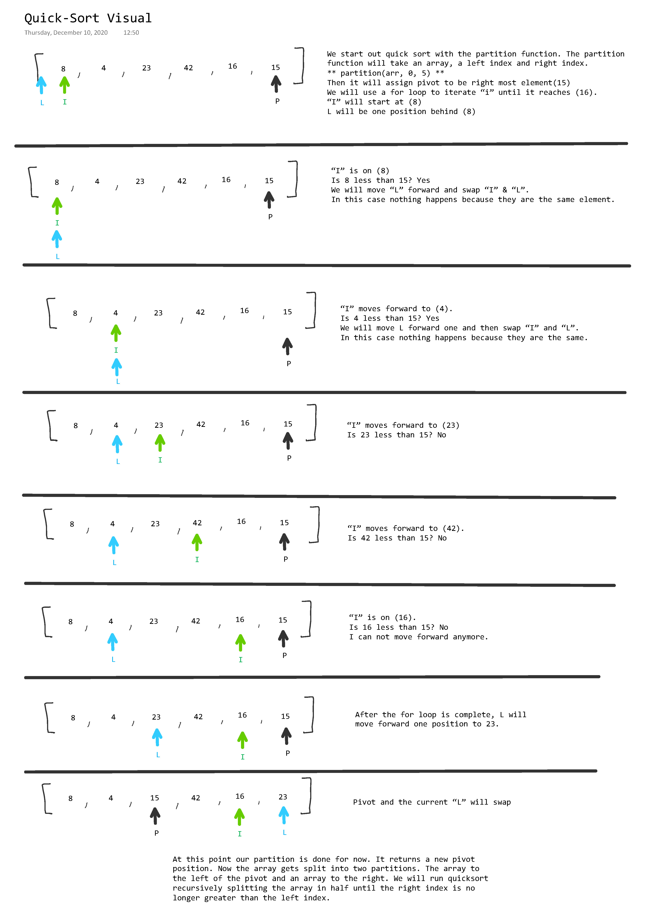

# Challenge 27: Quick Sort

<!-- Short summary or background information -->

## Challenge Description

<!-- Description of the challenge -->

Implement an array QuickSort Method

## Approach & Efficiency

<!-- What approach did you take? Why? What is the Big O space/time for this approach? -->

Quick Sort has a divide and conquer approach. The array uses a partition method that picks a pivot index and moves all values less than the pivot to the left side and greater values to the right side. This is called recursively sorting the left side and then the right until the right index is no longer greater than the left index.

Time Complexity:

Worst Case: O(n^2)
Best and Average Case: O(n Log n)

## Solution

<!-- Embedded whiteboard image -->

