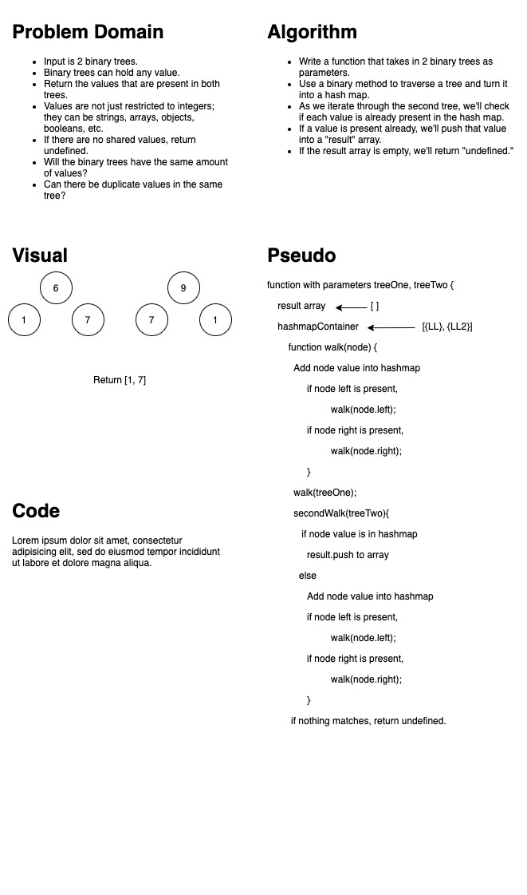

# Code Challenge 32 : Find common values in 2 binary trees

<!-- Short summary or background information -->

## Challenge Description

<!-- Description of the challenge -->

Given two binary trees, return a set of values found in both trees.

## Approach & Efficiency

<!-- What approach did you take? Why? What is the Big O space/time for this approach? -->

Iterate over the first tree using a preOrder method to add tree values into a Hashtable.  
Traverse the second tree checking to see if values are present in the hashMap. If it is, add to result array.

Space : O(n)  
Time: O(n)

## Solution

<!-- Embedded whiteboard image -->

