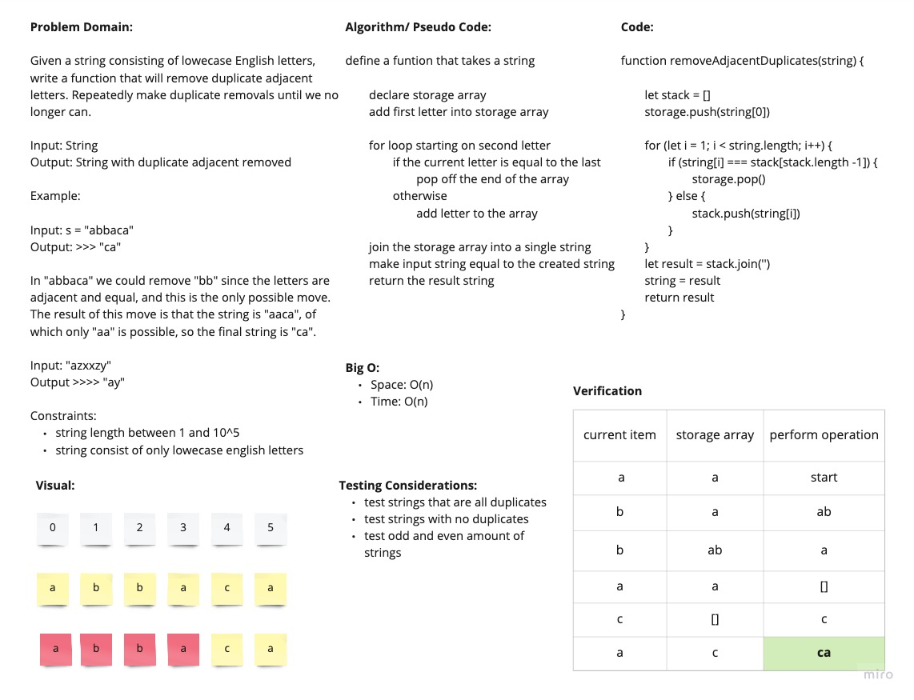

# Remove Adjacent Duplicates From String (Stacks)

Given a string consisting of only english lowercase letters, remove all adjancent duplicates

## White Board Process

## Approach and Efficiency

I utilized an array as a stack. I looped through each letter in the string. On each iteration I check if the letter in the string is the same as the last letter in the stack. If it is, I just pop off the stack. Otherwise I just add the letter to the stack. In the end, I join the array together and make that equal to the input string and return it.

Big O:

- Time: O(n)
- Space: O(n)
