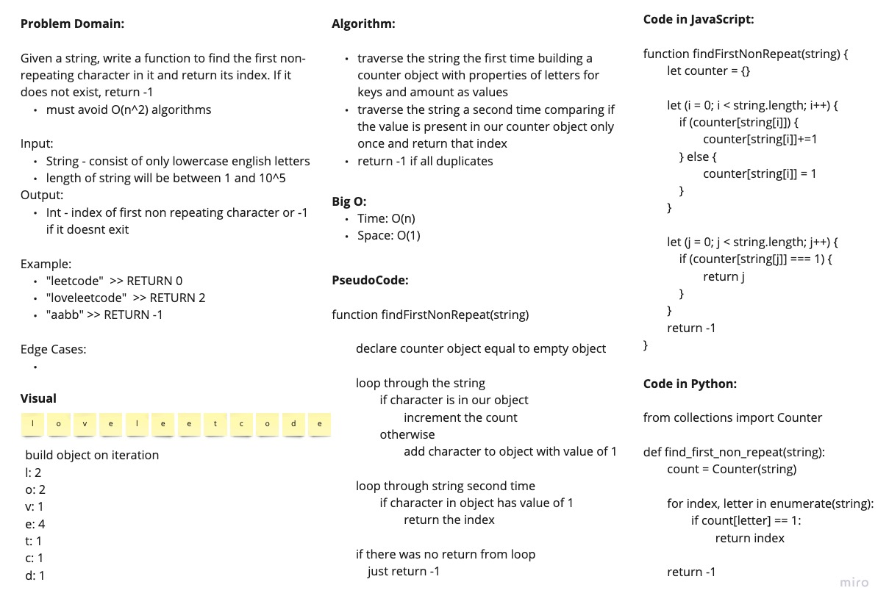

# First Unique Character

Given a string of only lowercase english letters, return the first unique character

## White Board Process

## Approach and Efficiency

I used a counter object or dictionary for this approach. I looped through the string the first time adding the letter to our counter object with a value of 1, or if it already exist in our counter object, just increment the count. The second traversal just checks if the letter is in our object and has a value of 1. If it does, it returns that index. If nothing got returned, we just return -1 at the end.

Big O:

- Time: O(n)
- Space: O(1) Since there is only 26 letters in the alphabet, no matter how big the string is, we can only have 26 properties in our counter object.
