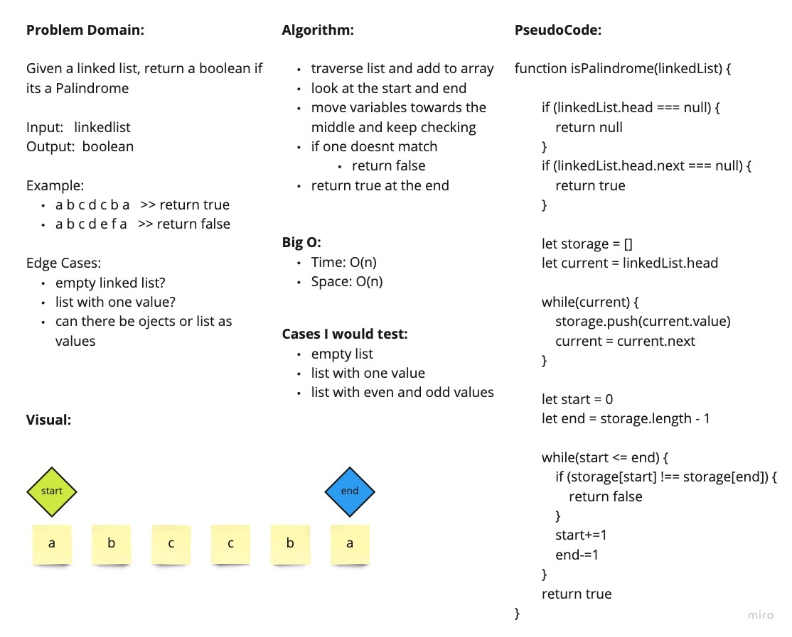

# Linked List Palindrome

Given a linked list, return a boolean if its a palindrome

## WhiteBoard Process

## Approach and Efficiency

I traversed the list and input all values into an array. I declared a start and end pointer to look at the first and last value of the array. I compared the two values and moved pointers inwards until the pointers meet. If at any point the values don't match, I return false. If it breaks out of the while loop, I return true

Big O:

- Space: O(n)
- Time: O(n)
