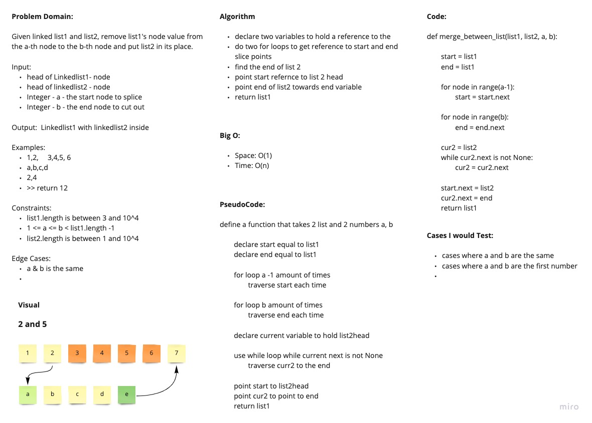

# Merge in Between Linked List

Given two linked list, and an "a" and "b" integer value, remove the nodes in linked list 1 from "a" to "b" and insert linked list 2.

## White Board Process

## Approach and Efficiency

I utilized two pointers to keep a reference of the start and end slicing points in the first list. I traversed "a-1" amount of times to get the start, and "b" amount of times to get the end slice point. Then I traversed the second list to grab its tail. I pointed start to list2 head and list2 tail to point to end. Then I returned the first linked list

Big O:

- Time: O(n)
- Space: O(1)
