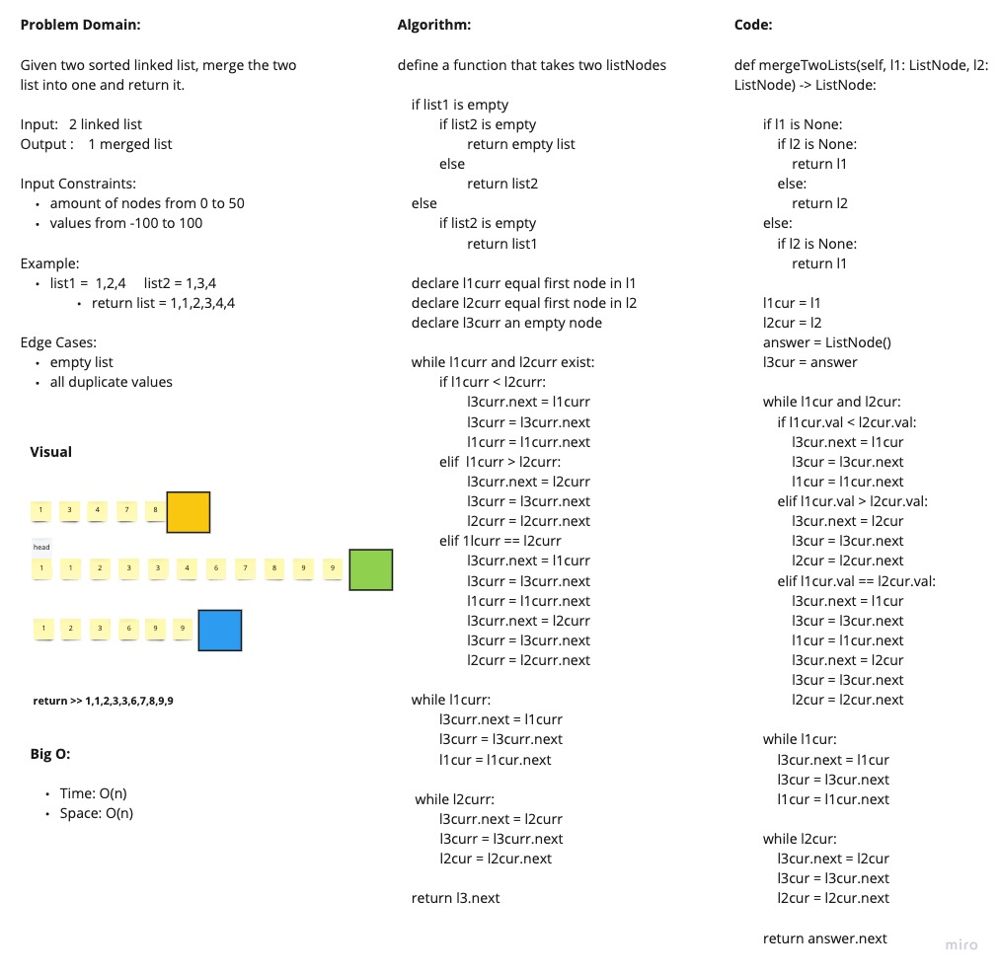

# Merge Sorted Linked List

Given two sorted linked list, return one list with them merged and sorted.

## Whiteboard

## Approach and Efficiency

I declared a new list. I used a current variable for both list. I compared the two values from both list, and inserted the lower value into the new list. If the values equal, i added both into the new list. On each iteration, I traversed the current to whatever was next. And returned the result list at the end.

Big O:

- Space: O(n)
- Time: O(n)
