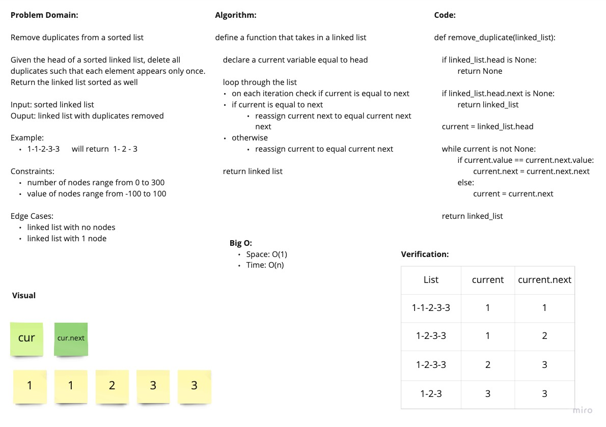

# Remove Duplicates from a Linked List

Remove duplicate values from a sorted linked list and return it

## Whiteboard Process

## Approach and Efficiency

Since the list is sorted, we only need to check the current and next variable to see if they're equal. If they are, just reassign the next pointer to whatever is in front of the duplicate

Big O:

- Time: O(n)
- Space: O(1)
