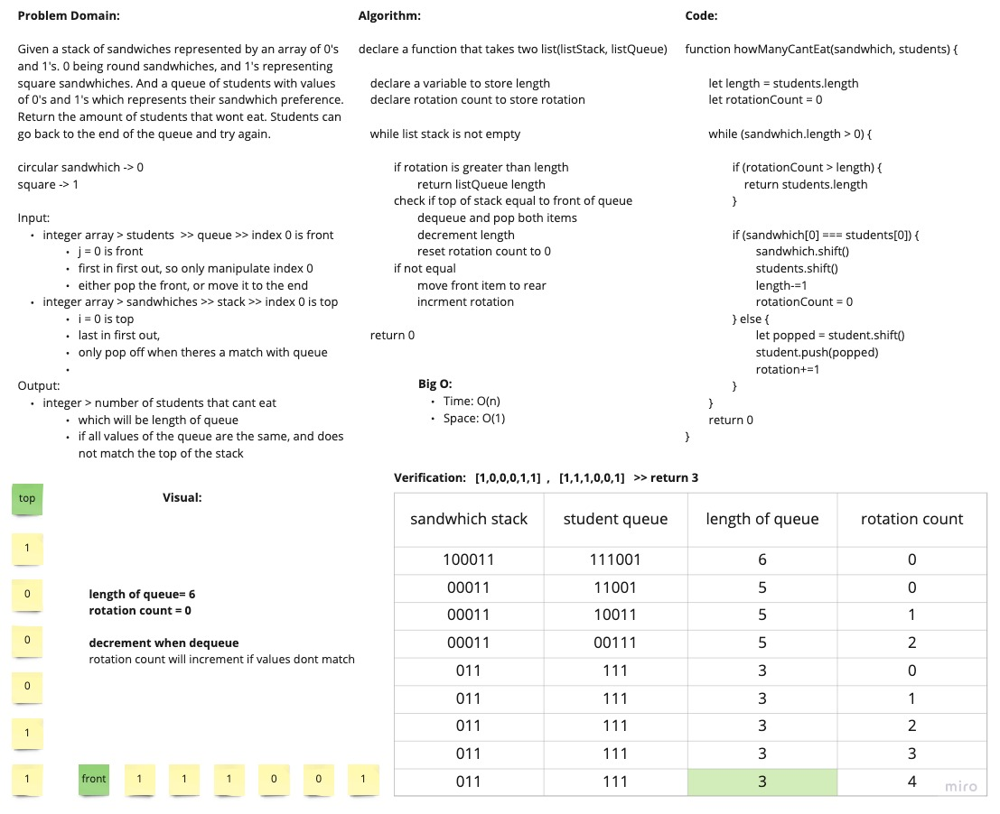

# Student Sandwiches

Given 2 arrays which represents a stack of square and circular sandwhiches, and a queue of students with sandwich preferences. 0 representing circular sandwhiches, and 1 representing square sandwhiches. Return the amount of students left that won't eat. Index 0 represents the front of the queue and top of stack. A student can go back to the end of the line if their preference isnt available at the time.

## WhiteBoard Process

## Approach and Efficiency

I utilized a variable to store the length of the queue and another variable for rotation count. I continue to compare both the front of the queue and top of the stack until the stack is empty. If the sandwich matches the student preference, I decrement the length and reset rotation. If no match, I increment rotationCount and move the student to the back of the line. If at any time rotation count is greater than length, I return the amount of students left.

Big O:

- Space: O(1)
- Time: O(n)
