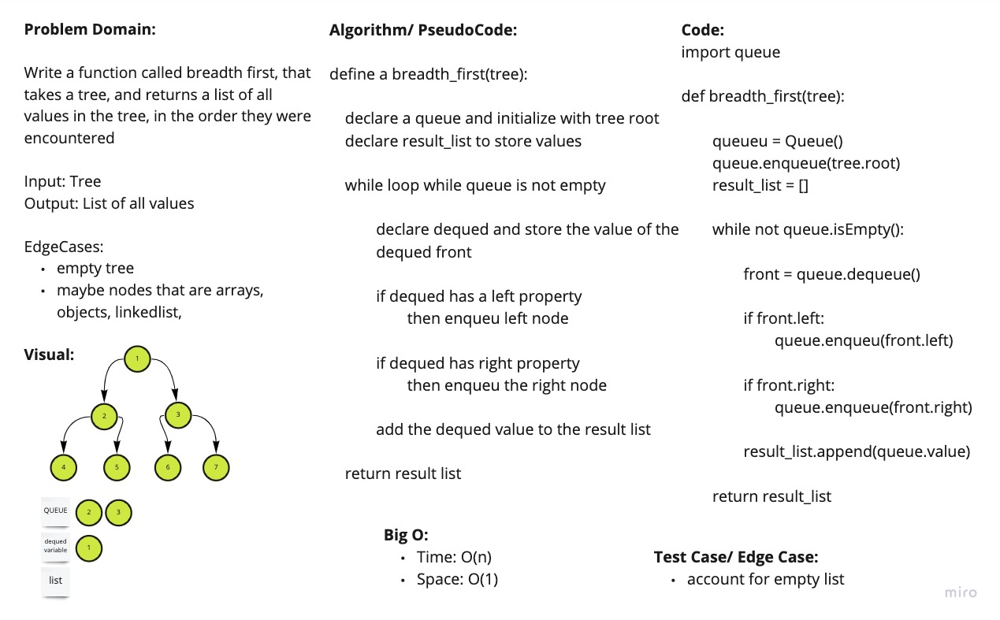

# Breadth First Traversal

Given a tree, return a list with a breadth first order.

## Links

- [See the Code](breadth_first.py)
- [See the Test](../tests/test_breadth_first.py)

## WhiteBoard Process

## Approach and Efficiency

Breadth first traversal uses a queue to keep track of the nodes. We initialize our queue with the root of the tree. Then start a while loop while the queue is not empty. We will dequeue, then enqueue that dequeued items left and right property. Then push the value into a result list. Then return that result list.

Big O:

- Time: O(n)
- Space: O(1)

## Collaborators

Daniel Dills, Wondwosen Tsige, Prabin Singh, Michael Ryan
