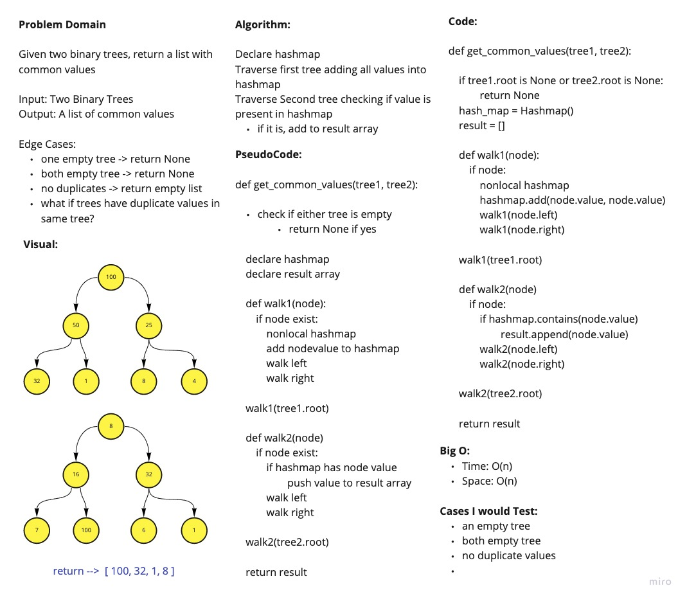

# Find Common Values in 2 Binary Tree

## Author: Davee Sok

## Links & Resources

- [See The Code](challenge32.py)
- [See The Test](../tests/test_challenge32.py)

## White Board

## Approach & Efficiency

We used a hashmap as a temporary container and result array to store the duplicates. We traverse the first tree putting all the values into the hashmap. Then we traversed the second tree. On each item, we check if its already present in our hashmap. If it is, we just add to our array. And then return the array at the end.

### Collaborators

Daniel Dills, Wondwosen Tsige, Prabin Singh, Michael Ryan, Marie Marcos, Garfield Grant
