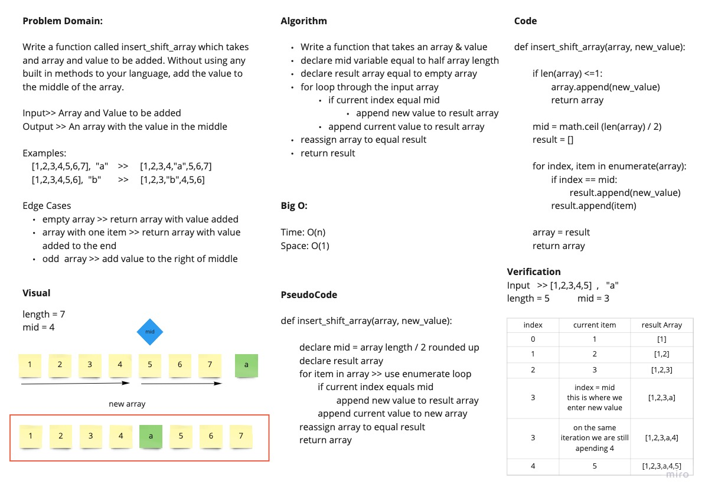

# Code Challenge 2: Insert into Middle of an Array
<!-- Description of the challenge -->
Given an array and a value to add, write a function to add the value to the middle of the array. Do not use any built in methods to your language.

## Whiteboard Process
<!-- Embedded whiteboard image -->

## Approach & Efficiency
<!-- What approach did you take? Discuss Why. What is the Big O space/time for this approach? -->
Our approach was to find the midpoint of the array. Use a temporary array container. Iterate through the input array adding all values into our temporary array. If the index is on the mid, add the new value and continue with the array. We took this approach because we thought it may be the most efficient with the time that we had.

Big O:

- Time: O(n)
- Space: O(n)
