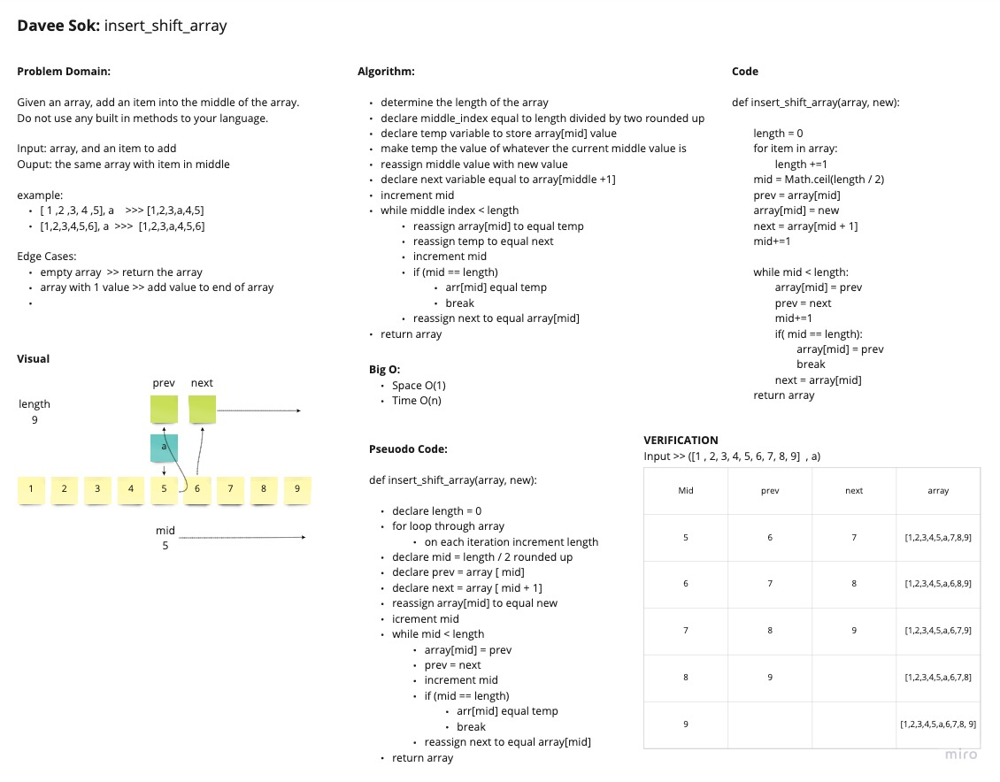

# Insert to Middle of an Array
<!-- Description of the challenge -->
Write a function called insertShiftArray which takes an array and inserts a value in the middle. Without using any built-in-methods to your language, return an array with the new value added.

## Whiteboard Process
<!-- Embedded whiteboard image -->

## Approach & Efficiency
<!-- What approach did you take? Discuss Why. What is the Big O space/time for this approach? -->

The approach I took on this was to get the length of the array. Use that to find the midpoint. Temporarily store the middle value into a prev variable. Assign the current middle value to the new value being added. Then loop to the end of the array moving values one position forward on each iteration. I took this approach because I thought this may be the most efficient during the time constraint I had. I think there's probably a better way, and I did have another approach in mind, but I just went ahead and took this route.

- Time O(n)
- Space O(1)
