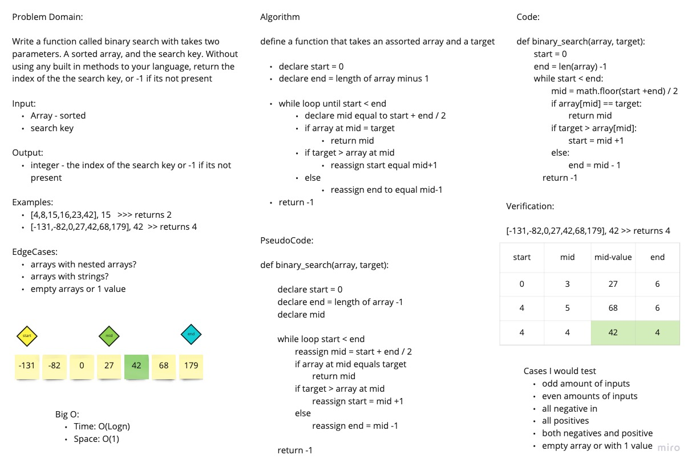

# Binary Search of Sorted Array
<!-- Description of the challenge -->
Given a sorted array and a key value use binary search to return the index of the key value.

## Whiteboard Process
<!-- Embedded whiteboard image -->

## Approach & Efficiency
<!-- What approach did you take? Discuss Why. What is the Big O space/time for this approach? -->
We utilized the binary search method. Declare a start, mid, and end variable. Ressign start or end based on where the target is in comparison to the mid value.

Big O:

- Space: O(n)
- Time: O(Logn)
