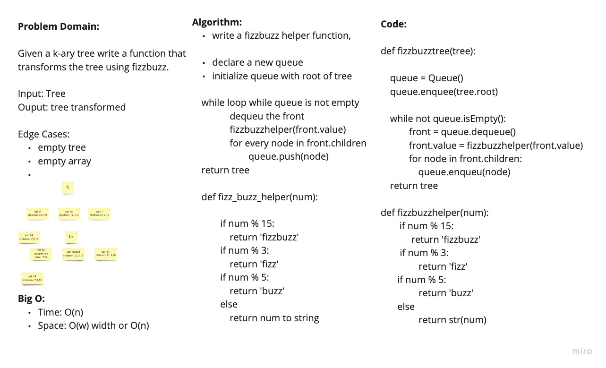

# FizzBuzz K-ary Tree

Given a k-ary Tree, transform the tree according to FizzBuzz rules.

## Links

- [See The Code](./fizz_buzz_tree.py)
- [See The Test](../tests/test_fizz_buzz_tree.py)

## WhiteBoard Process

## Approach and Efficiency

We utilized a fizzbuzz helper function to modularize the fizzbuzz logic. We traversed the tree using breadth first approach. Declare a queue and initialize it with the root. While the queue is not empty, dequeu a node from the queue. Use fizzbuzz helper to change the value. Then add the rest of the children to our queue. At the end return the tree.

Big O:

- Time: O(n)
- Space: O(w)  w - the largest width of any tree level

### Collaborators

Daniel Dills, Prabin Singh, Wondwosen Tsige, Michael Ryan, Kassie Bradshaw, Garfield Grant
