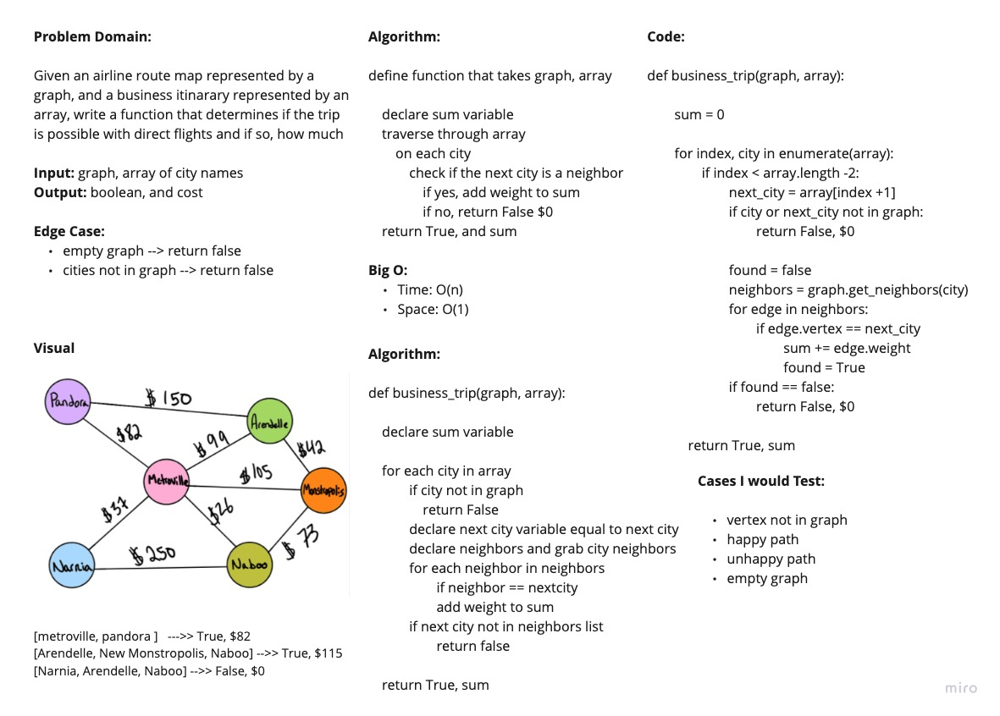

# Graph Business Trip

Given an airline route map represented by a graph, and a business itinarary represented by an array, write a function that determines if the trip is possible with direct flights and if so, how much

## Links

- [See The Code](graph_business_trip.py)
- [See The Test](../tests/test_graph_business_trip.py)

## Whiteboard

## Approach & Efficiency

We looped through the array. On each loop we check if the next city is present in the current cities neighbors. If it is, we add. If not, we return false. If no false was returned, we return true and the sum

Big O:

- Time: O(n)
- Space: O(1)

### Collaborators

Daniel Dills, Prabin Singh, Wondwosen Tsige, Michael Ryan, Marie Marcos, Garfield Grant
