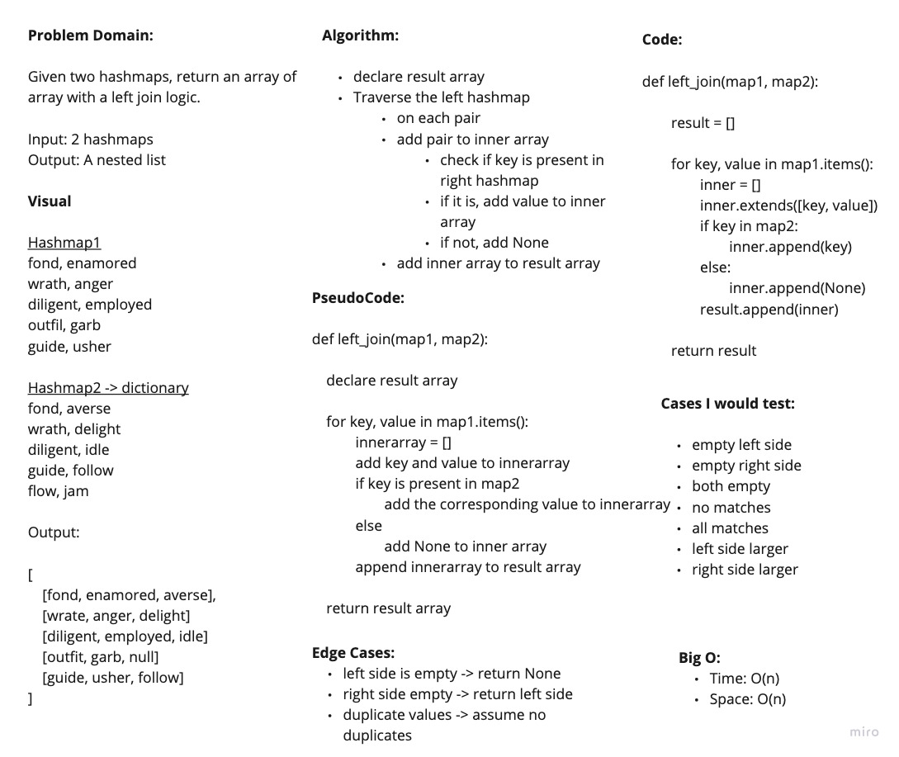

# Left Join

Given two hashmaps, perform a left join

## Links

- [See The Code](left_join.py)
- [See The Test](../tests/test_left_join.py)

## WhiteBoard Process

## Approach and Efficiency

We declared a result array to store the values. We traversed the first object. On each iteration, we check if the current key is present in the second object. If it is, we add the corresponding value to the inner array. If not we add None. After each iteration, we add the inner array to the result array.

Big O:

- Time: O(n)
- Space: O(n)

### Collaborators

Daniel Dills, Prabin Singh, Wondwosen Tsige, Michael Ryan,
