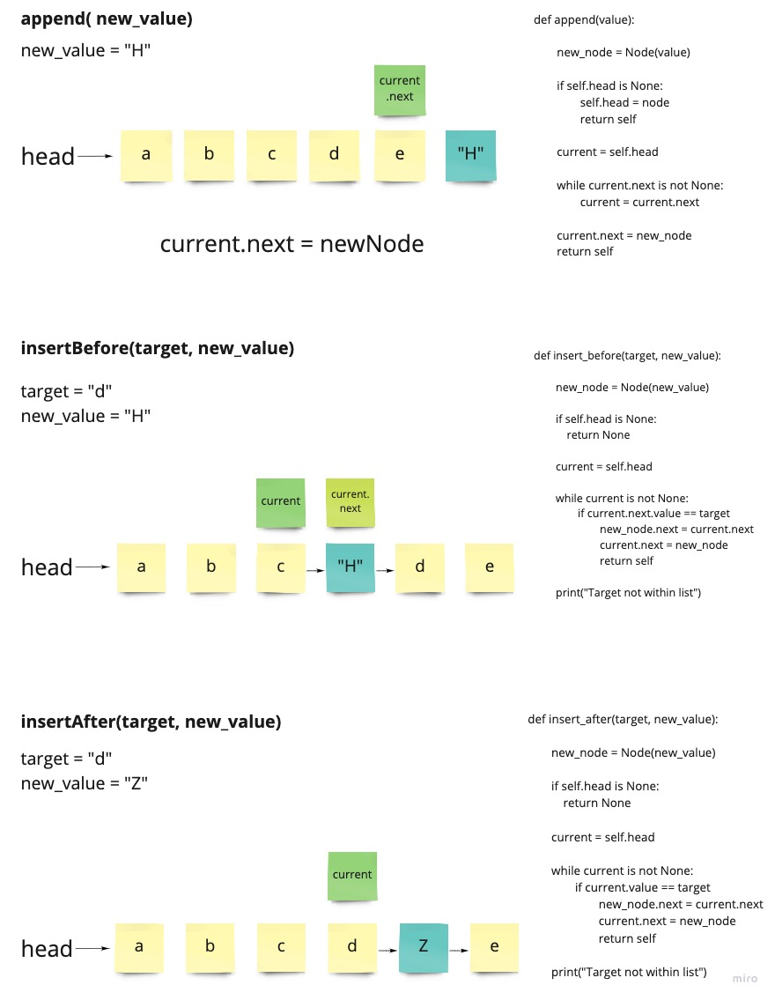

# Singly Linked List
<!-- Short summary or background information -->

A collection of methods on a Linked List Class

- [Link to the Code](linked_list.py)

## Linked List Methods

### Insert

- Create a new Node
- Have that node point to whatever head is pointing at
- Reassign head to equal the new node
- Big O:
  - Time: O(1)
  - Space: O(1)

### Includes

- Declare a variable called current equal to head
- Use a while loop to traverse the list
- On each node, check if its the target
- Return true if its found
- Return false if while loop doesnt return true
- Big O:
  - Time: O(n)
  - Space: O(1)

### To String

- Declare a variable to store a string
- Use a while loop to traverse the list
- On each node, add the value in string format
- Return the string at the end
- Big O:
  - Time: O(n)
  - Space: O(1)

### Append

- Use a while loop to traverse all the way to the end
- Make the last node's next property equal to the new node
- Big O:
  - Time: O(n)
  - Space: O(n)

### Insert After

- Use a while loop to traverse the list
- If the current value equals the target value
- Point the new Node to whatever current is pointing to
- Point the current node to the new node
- Big O:
  - Time: O(n)
  - Space: O(1)

### Insert Before

- Use a while loop to traverse the list
- If the currents next value equals the target value
- Point the new Node to whatever current is pointing to
- Point the current node to the new node
- Big O:
  - Time: O(n)
  - Space: O(1)

