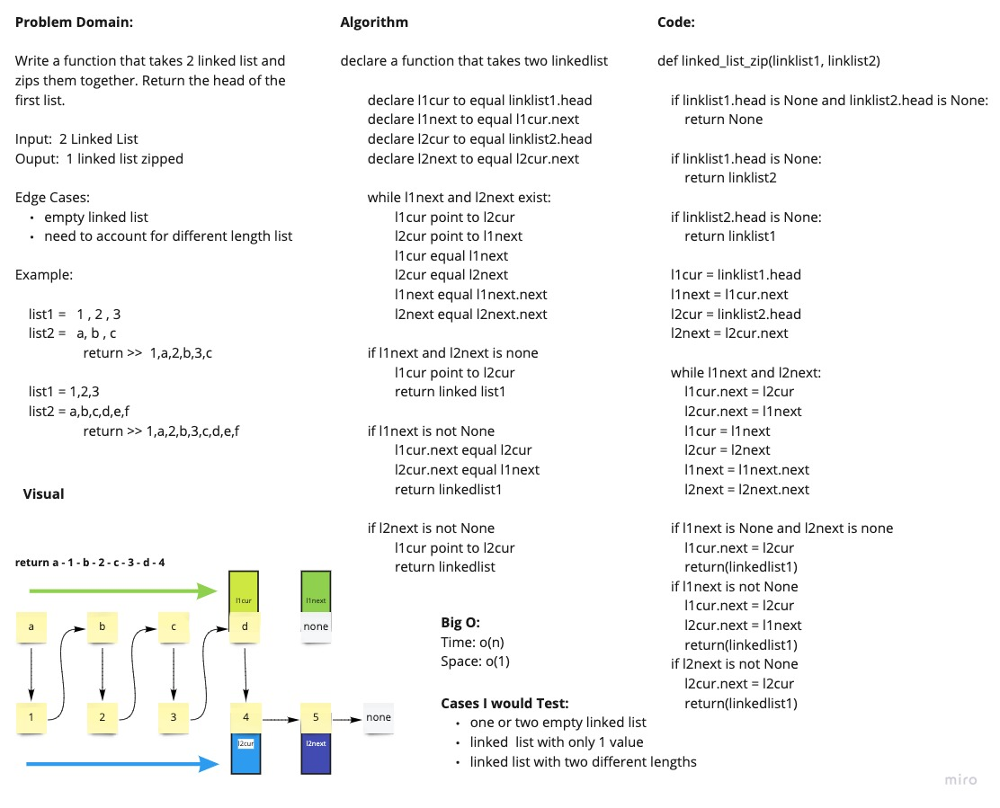

# Linked List Zip

Given two linked list, return them zipped together.

## Whiteboard Process

## Approach & Efficiency

We utilized 4 pointers. A current and a next for both the first and second linked list. We reassigned list1 current to point to the list2 current. And then list2 current to point to list1 next. Then reassigned all variable to move one spot to the right and continued traversal until one list ended. Depending on which one ended, We pointed the shorter list to connect to the longer list.

Big O:

- Space: O(1)
- Time: O(n)

[See the Code](../linked_list.py)
