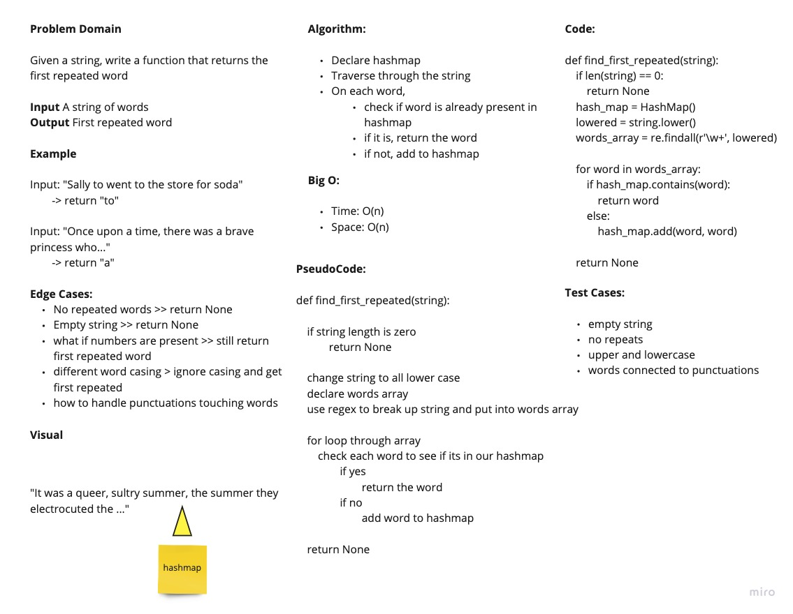

# Hashmap First Repeated Word

Given a string, return the first repeated word

## Links

- [See the Code](repeated_word.py)
- [See the Test](../tests/test_first_repeated_word.py)

## WhiteBoard Process

## Approach and Efficiency

We used a hashmap for the problem. We lower cased all the words and put the words into a list. Then we traversed the list checking if the word is in our hashmap. If it is, we return the word. If not, we just add to our hashmap and move to the next word.

Big O:

- Time: O(n)
- Space: O(n)

### Collaborators

Daniel Dills, Wondwosen Tsige, Prabin Singh, Michael Ryan
