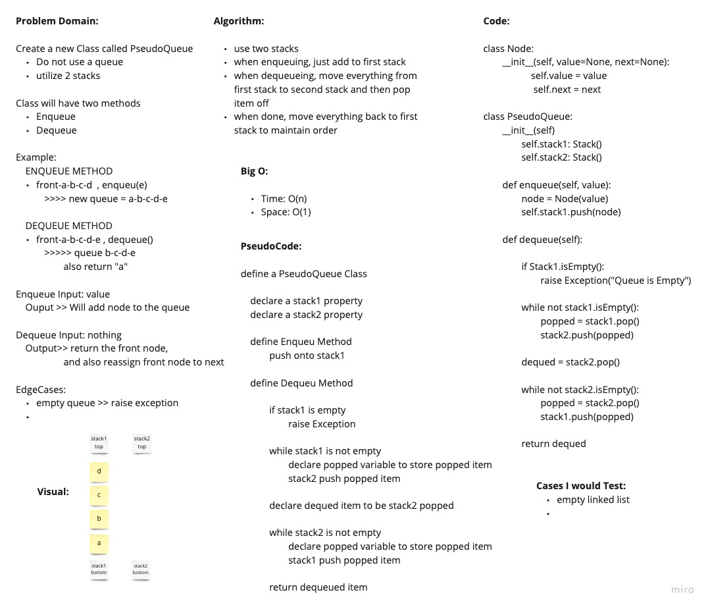

# Pseudo Queue with Stacks

Implement a Queue class using two stacks

## Links

- [See the Code](stack_queue_pseuodo.py)
- [See the Test](../tests/test_stack_queue_pseudo.py)

## White Board Process

## Approach and Efficiency

We used two stacks. All items get pushed and stored on the first stack. Whenever a dequeu needs to happen, we move everything from the first stack to the second and then pop off. Then to keep the correct order, we pop everything back into the first stack.

Big O:

- Time: O(n)
- Space: O(1)

### Collaborators:

Daniel Dills, Prabin Singh, Michael Ryan, Wondwosen
