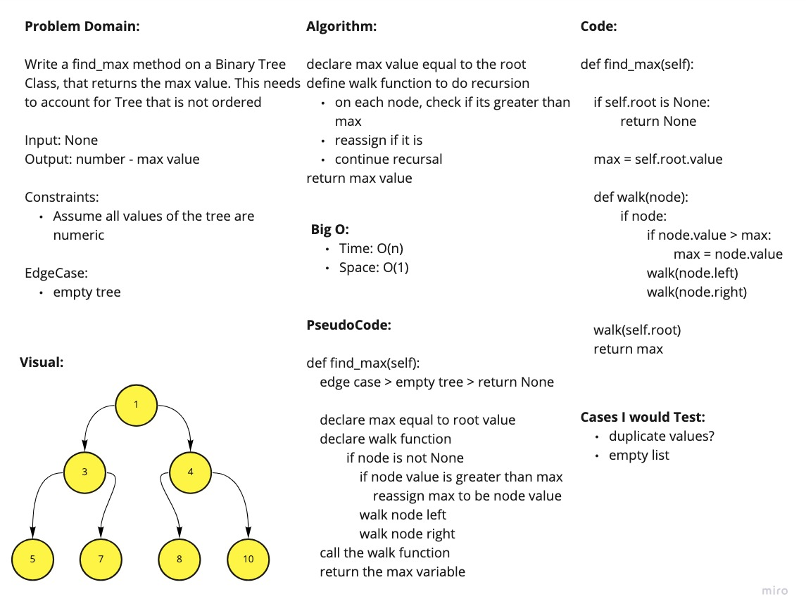

# Binary Trees & Binary Search Trees

## Links

- [See the Code](trees.py)
- [See the Tests](../tests/test_trees.py)

## Binary Tree

Create a Binary Tree class
Define a method for each of the depth first traversals:

- pre order
- in order
- post order

Any exceptions or errors should be semantic, capture-able errors.

## Binary Search Tree

Create a Binary Search Tree class
This class should be a sub-class of the Binary Tree Class, with the following additional methods:

### Add

- Arguments: value
- Return: nothing
- Adds a new node with that value in the correct location in the binary search tree.

### Contains

- Argument: value
- Returns: boolean indicating whether or not the value is in the tree at least once.

### Find Max

- Find the maximum value in the Tree. The method needs to account for trees that are sorted and unsorted.

Whiteboard:

Approach & Efficiency:

I used a max variable to hold the highest value. I initialized that variable with the root value. And then i used a preOrder traversal to go through every node and check if there is a greater value. If there is, I reassign the max with the current value. Any traversal method would work.

Big O:

- Time: O(n)
- Space: O(1)
